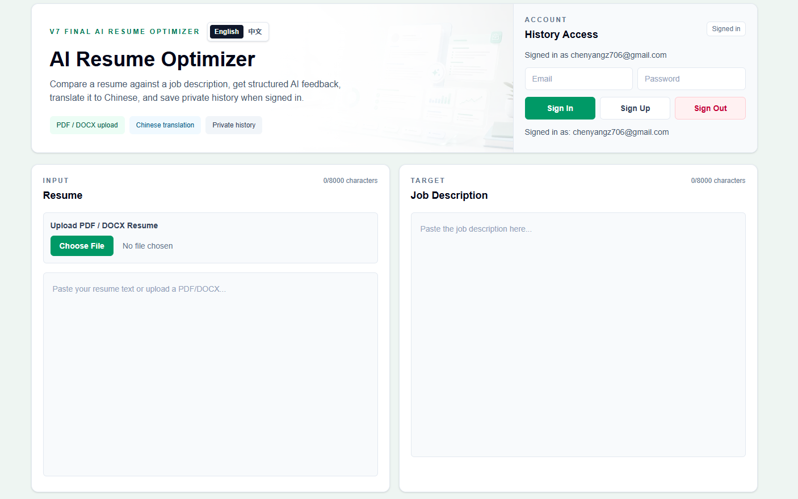
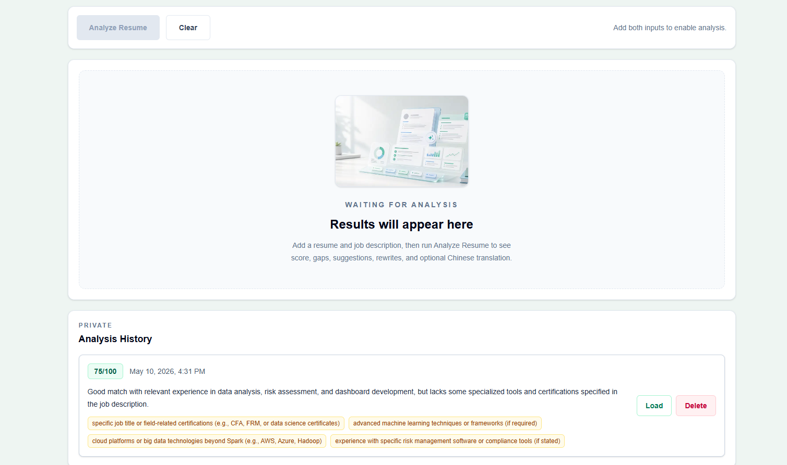
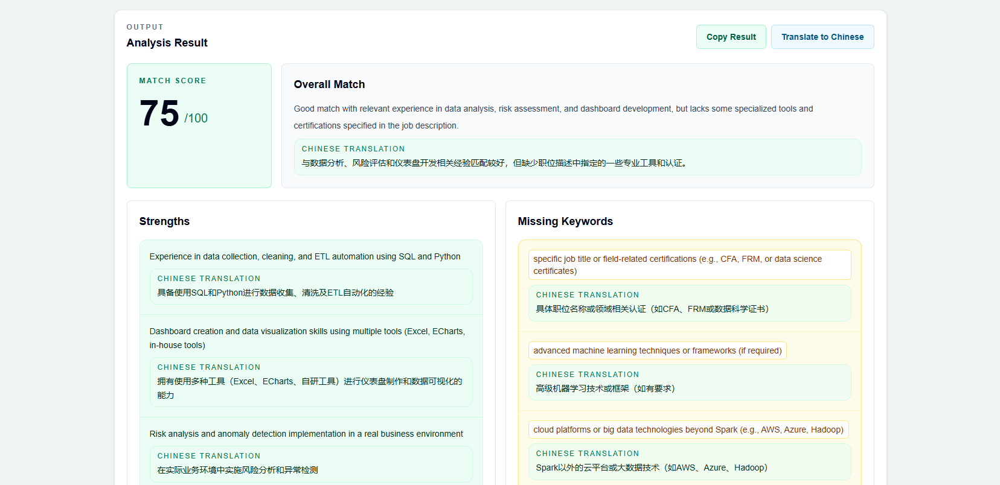
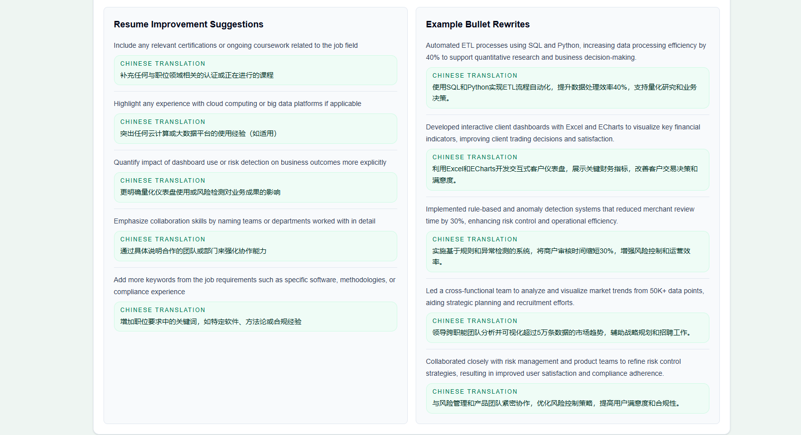
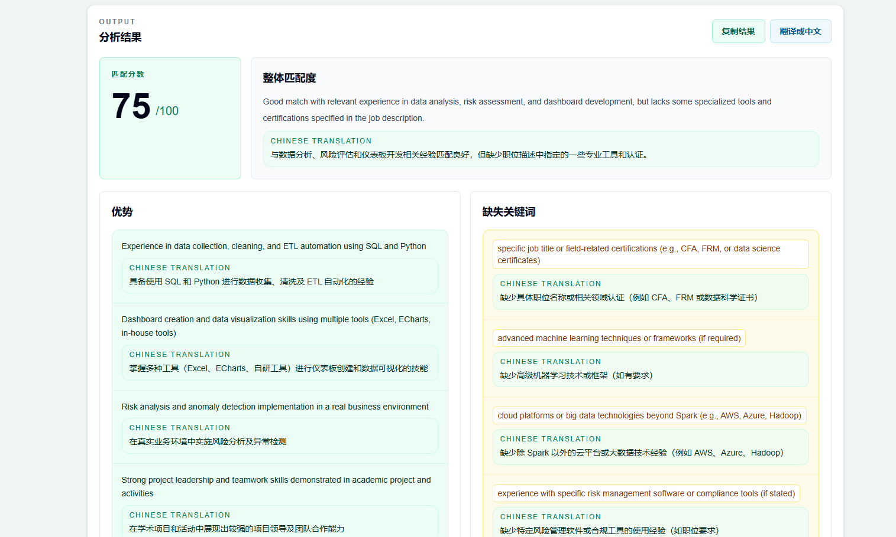

# AI Resume Optimizer

A production-like AI SaaS demo that helps users compare a resume against a job description, receive structured AI feedback, translate results into Chinese, and save private analysis history.

## Why This Project Matters

This is more than a simple OpenAI API demo. It includes a real full-stack workflow with authentication, database history, document upload, structured AI output, bilingual UX, exact caching, and a RAG-ready architecture.

## Product Flow

1. Sign in with email and password.
2. Upload a PDF/DOCX resume or paste resume text manually.
3. Paste a target job description.
4. Run AI analysis.
5. Review match score, strengths, missing keywords, suggestions, and bullet rewrites.
6. Translate the result into Chinese when needed.
7. Save, load, and delete private analysis history.

## Screenshots

### Dashboard And Auth



The dashboard includes auth, resume upload, job description input, and English/Chinese UI toggle.

### Empty State And History



The app includes private analysis history with score, summary, missing keywords, Load, and Delete actions.

### Structured AI Result



AI output is rendered as structured cards instead of unstable plain text.

### Suggestions And Bullet Rewrites



The result includes actionable improvement suggestions and example resume bullet rewrites.

### Chinese UI Mode



The UI supports a lightweight English / Chinese toggle, while analysis translation remains user-triggered.

## Key Features

- Structured OpenAI resume/JD analysis.
- Match score, strengths, missing keywords, suggestions, and bullet rewrites.
- Supabase Auth with email/password sign in.
- Supabase PostgreSQL analysis history.
- Row Level Security for user-specific records.
- PDF and DOCX resume upload.
- Optional Supabase Storage upload for signed-in users.
- Manual Chinese translation of analysis results.
- English / Chinese UI toggle.
- Exact cache using `resume_hash + jd_hash`.
- RAG fallback design with resume chunks, embeddings, and pgvector.
- Graceful fallback to full resume analysis when RAG is unavailable.

## Tech Stack

- Next.js App Router
- React
- TypeScript
- Tailwind CSS
- OpenAI SDK
- Supabase Auth
- Supabase PostgreSQL
- Supabase Storage
- Supabase pgvector

## Local Quick Start

```bash
npm install
npm run dev
```

Create `.env.local` before running the app:

```env
OPENAI_API_KEY=your_openai_api_key_here
NEXT_PUBLIC_SUPABASE_URL=your_supabase_project_url
NEXT_PUBLIC_SUPABASE_ANON_KEY=your_supabase_anon_key
```

Detailed Supabase SQL, Storage setup, RAG setup, and replication steps are in [docs/setup-guide.md](docs/setup-guide.md).

## Project Evolution

The project was built iteratively:

- V1: Basic OpenAI call with plain-text output.
- V2: Structured JSON output and card-based rendering.
- V3: Input limits, JD cleanup, Clear, Copy Result, and better UX.
- V4: Supabase Auth, PostgreSQL, RLS, and private history.
- V5: PDF/DOCX upload, Supabase Storage, and Chinese translation.
- V6: Dashboard UI redesign and improved translation display.
- V7: Exact cache, RAG fallback architecture, and simple i18n toggle.

Detailed version notes are in [docs/development-notes.md](docs/development-notes.md).

## Remaining Limitations

- Exact cache is implemented, but true semantic cache is still future work.
- PDF/DOCX formatting is not preserved.
- Scanned PDFs need OCR or a stronger document parser.
- No production monitoring or rate limiting yet.
- Storage policies should be hardened before production use.

## Useful Commands

```bash
npm run lint
npm run build
npm run dev
```
